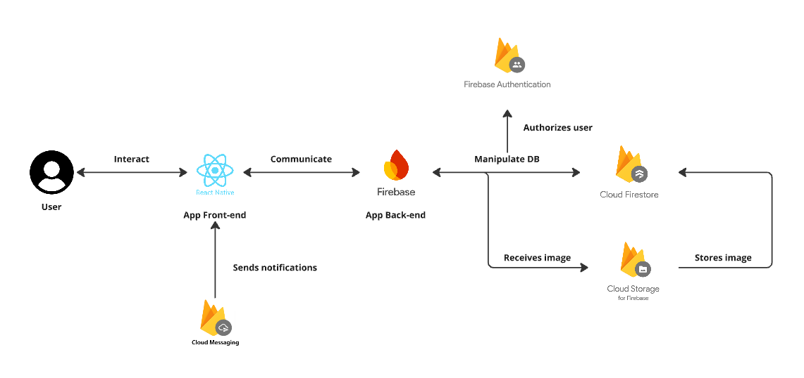

# taskManagerApp

## 📖 Table of Contents 📖

1. [To-do's](##To-do's)
2. [Software design](##software-design)
3. [Getting started](##getting-started)

## To-do's

1. Create a new React Native Application
   - [x] Create a new React Native project
   - [x] Use functional components and hooks
2. Firebase Integration
   - [x] Use Firestore for storing task and user data
   - [x] Use Firebase Authentication to allow users to sign up, log in, and log out
3. Task Manager Features
   - [x] Task Management: Implement CRUD operations (Create, Read, Update, Delete)
         for tasks using Firestore
   - [x] Task List: Display a list of tasks fetched from Firestore
4. Leaderboard Feature
   - [x] Track the number of tasks each user completes
   - [x] Implement a leaderboard that displays the top users who have completed the most tasks
   - [x] Allow the leaderboard to be filtered by time periods (daily, weekly, monthly)
5. Bonous
   - [ ] Include notifications for task reminders using Firebase Cloud Messaging.
   - [ ] Write unit tests for critical parts of the application
   - [ ] Add the ability for users to upload and display images for each task using Firebase Storage
   - [x] Implement form validation for the authentication and task forms
   - [x] Use TypeScript for type safety

## Software design



## Getting Started

#### Prerequisites

- Install yarn
- Install depenencies for ios
  ```bash
  yarn install
  cd ios
  pod install
  cd ..
  ```
  Then go to Xcode `cmd + b` to download the app onto simulator

#### Start the Metro Server

```bash
yarn start # Then chose the simulator you want to work with
```
